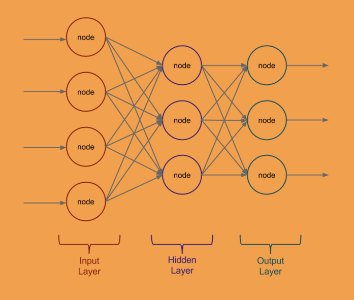

Neuronal Network
=======

<br>
[](https://pkg.go.dev/github.com/sjwhitworth/golearn)


My neural network was built and is being built, using third party packages like GoLearn

twitter: [@Arturo0911](https://twitter.com/DevTuron)

Modules used
=======

See [here](https://github.com/sjwhitworth/golearn) for GoLearn.

Getting Started
=======

Data are loaded in as Instances. You can then perform matrix like operations on them, and pass them to estimators.
GoLearn implements the scikit-learn interface of Fit/Predict, so you can easily swap out estimators for trial and error.
GoLearn also includes helper functions for data, like cross validation, and train and test splitting.


Basic Structure from NeuronalNetworks
========



Examples
========

GoLearn comes with practical examples. Dive in and see what is going on.

```bash
cd $GOPATH/src/github.com/Artur0911/NN/examples/knnclassifier
go run knnclassifier_iris.go
```

